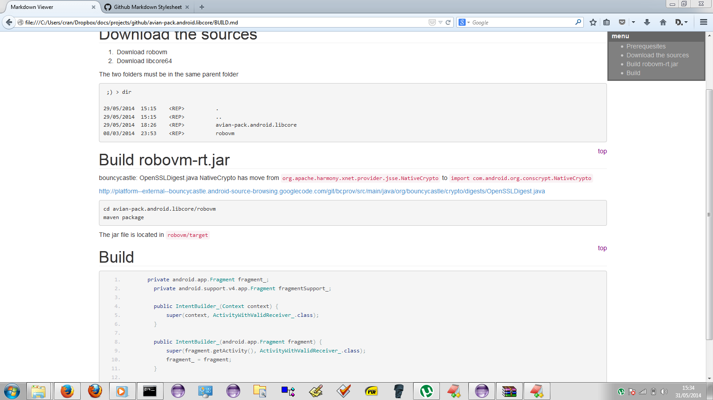

# Markdown Viewer README

A Markdown Viewer add-on for Firefox with the github styling.

https://addons.mozilla.org/fr/firefox/addon/markdown-viewer/

# How to build

1. [Download](archive/master.zip) the repository
2. Zip the content of the repository (the file `install.rdf` must be at the root of your zip)
3. Delete the folder `binaries`
3. Open the file in Firefox (Ctrl+O)

# Download the extension from github

[Mardown viewer 2.0](binaries/markdown-viewer-2.0.xpi)
